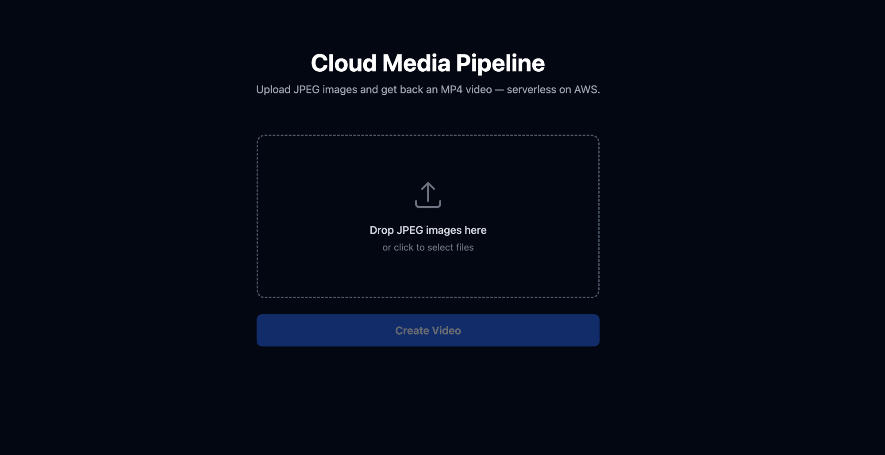
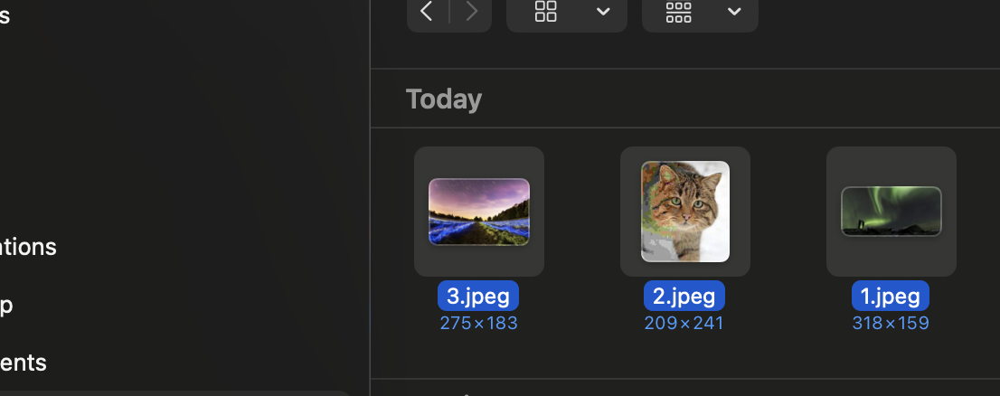
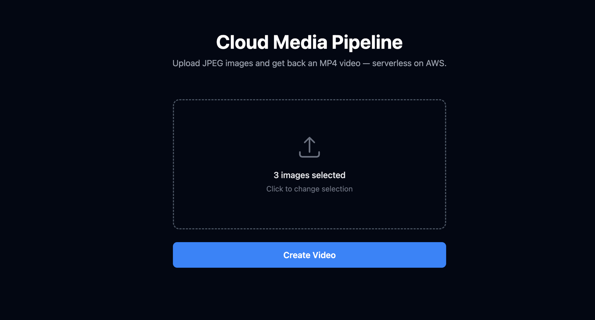
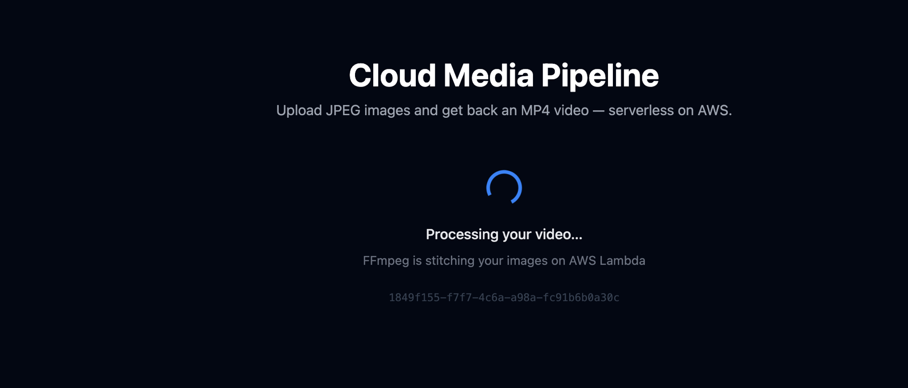
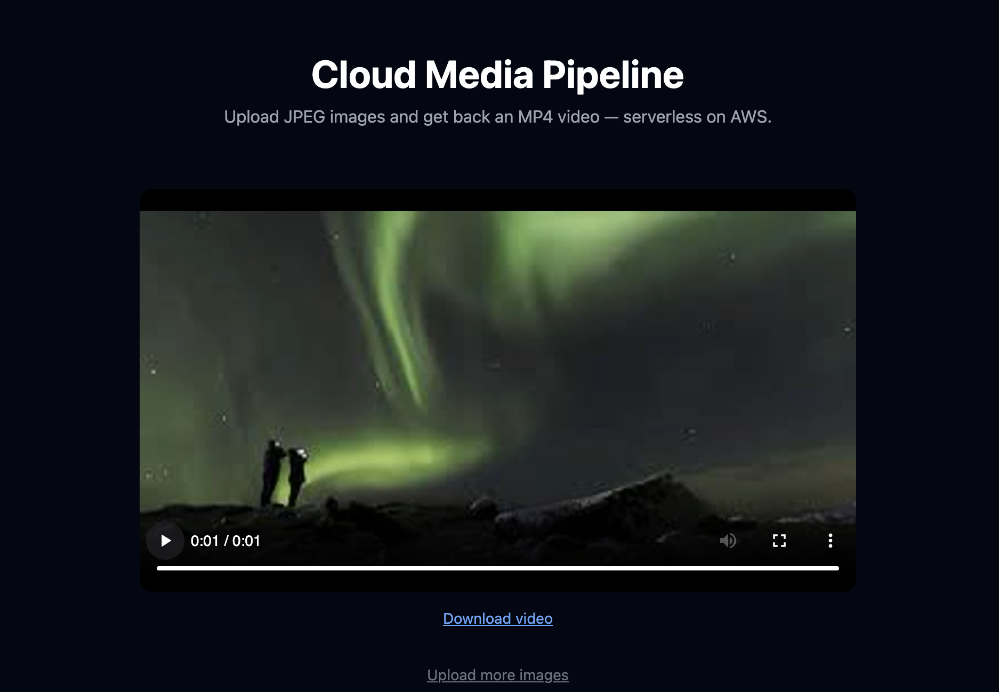
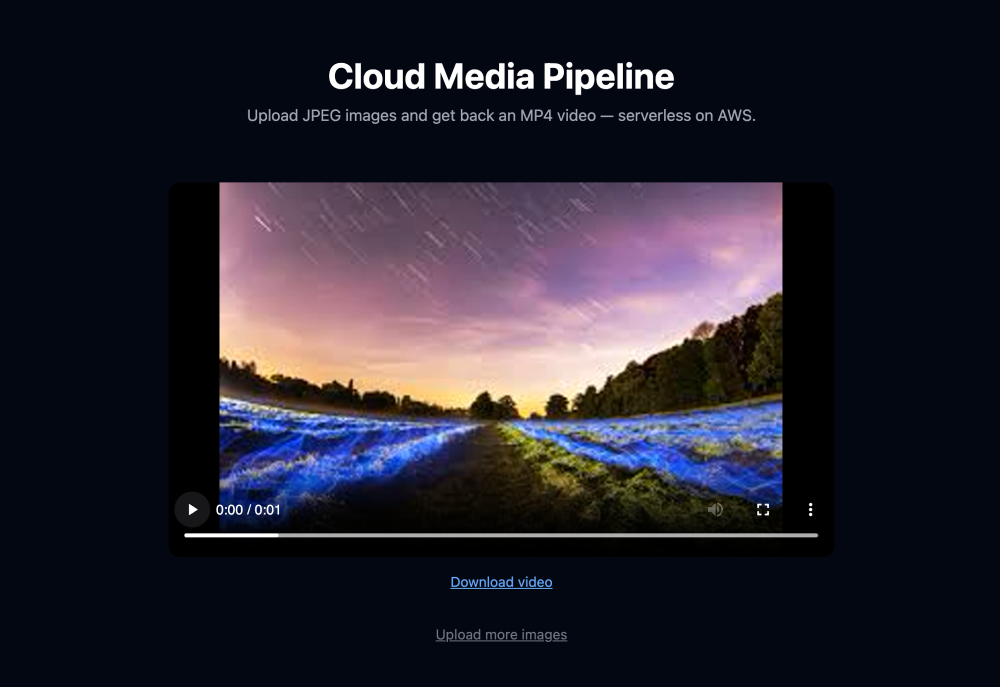
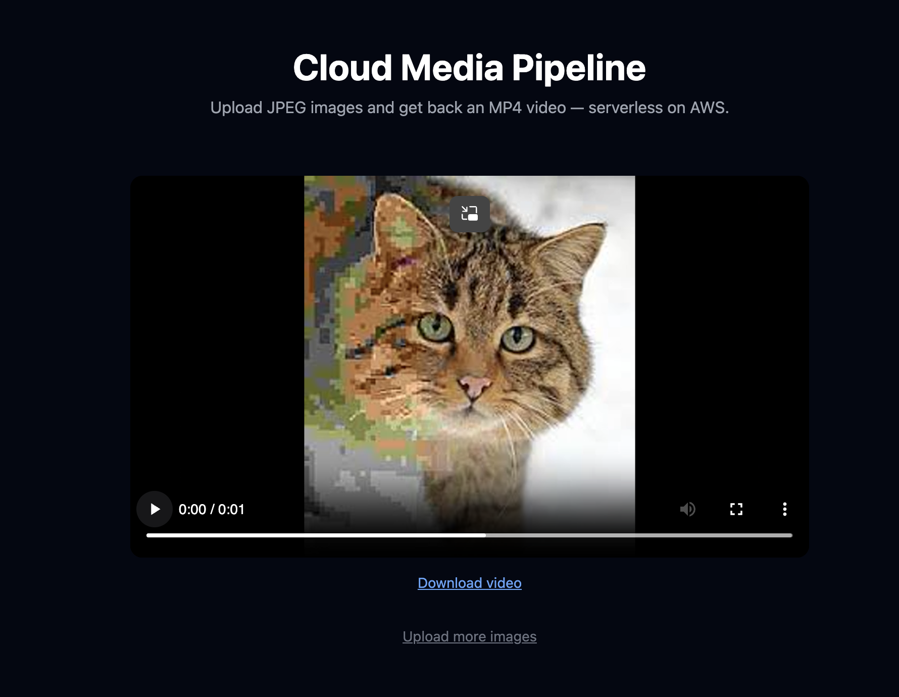
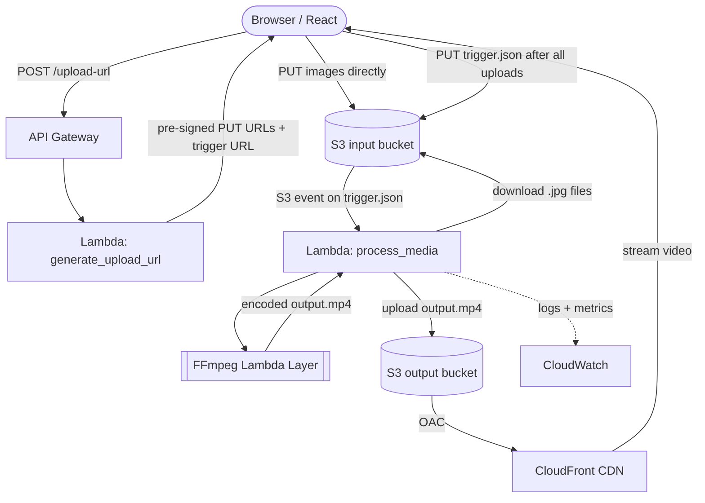

# Cloud Media Processing Pipeline

A serverless, event-driven media processing pipeline on AWS. Users upload JPEG images via a React frontend; an automated Lambda pipeline stitches them into an MP4 using FFmpeg and delivers the result via CloudFront CDN — no servers, no polling, no manual steps.

## Demo

| Step | Screenshot |
|---|---|
| Upload zone — drop or click to select JPEGs |  |
| macOS file picker |  |
| 3 images queued for upload |  |
| Processing — Lambda + FFmpeg running |  |
| Output video — frame 1 (aurora borealis) |  |
| Output video — frame 2 (light field) |  |
| Output video — frame 3 (cat) |  |

## Architecture



**Key design decisions:**

- **Pre-signed URLs** — the browser PUTs files directly to S3. Lambda never handles raw bytes, so file size doesn't affect Lambda memory or duration.
- **Trigger file pattern** — the frontend PUTs all images first, then uploads `trigger.json`. Lambda fires only on `trigger.json`, guaranteeing every image is present before processing starts. This eliminates the race condition you get when triggering on each individual upload.
- **Separate input/output buckets** — clean IAM boundary; Lambda can't accidentally read its own output as new input.
- **FFmpeg as a Lambda Layer** — keeps the deployment package small; the layer is reusable across functions.
- **CloudFront with OAC** — output bucket is fully private; only CloudFront can read it.

## Tech Stack

| Layer | Technology |
|---|---|
| Frontend | React (Vite), TailwindCSS |
| Upload | S3 Pre-signed URLs (direct browser → S3) |
| API | AWS API Gateway HTTP API + Lambda |
| Processing | AWS Lambda (Python 3.11) + FFmpeg Lambda Layer |
| Storage | S3 input bucket + S3 output bucket |
| Delivery | AWS CloudFront (OAC, PriceClass_100) |
| Monitoring | AWS CloudWatch (logs, metrics, alarms, dashboard) |

## Project Structure

```
cloud-media-pipeline/
├── frontend/                        # React upload UI
│   └── src/
│       ├── components/
│       │   ├── UploadZone.jsx       # Drag-and-drop image upload + progress bar
│       │   ├── JobStatus.jsx        # Polls CloudFront until output video appears
│       │   └── VideoPlayer.jsx      # Streams output MP4 + download link
│       ├── pages/Home.jsx
│       └── utils/
│           ├── api.js               # API Gateway calls
│           └── s3Upload.js          # Direct-to-S3 upload + trigger file logic
│
├── lambda/
│   ├── generate_upload_url/handler.py   # Returns pre-signed PUT URLs + trigger URL
│   ├── process_media/handler.py         # S3-triggered FFmpeg stitching
│   └── layers/README.md                 # How to build + publish the FFmpeg layer
│
├── infra/
│   ├── s3-setup.md                  # Bucket config, CORS, lifecycle rules, event notifications
│   ├── lambda-setup.md              # Lambda config, IAM roles, env vars, layer attachment
│   ├── apigateway-setup.md          # HTTP API routes + CORS
│   └── cloudfront-setup.md          # Distribution, OAC, price class
│
├── docs/
│   ├── architecture.md              # Full design rationale + tradeoffs
│   ├── benchmarks.md                # CloudWatch-based performance data
│   ├── cloudwatch-setup.md          # Dashboard, alarms, log insights queries
│   └── screenshots/                 # Demo screenshots used in this README
│
├── deployment.md                    # Step-by-step rebuild guide + free-tier checklist + teardown
└── .env.example                     # Frontend environment variables
```

## Local Development

The Vite dev server includes a mock API plugin that simulates both the pre-signed URL endpoint and S3 uploads, so the full upload flow can be tested without any AWS infrastructure.

```bash
cd frontend
cp ../.env.example .env   # leave VITE_API_URL blank for local mock mode
npm install
npm run dev
```

Drop some JPEGs in the upload zone — the mock returns a fake `job_id` and simulates the PUT calls, so you can verify the UI flow end-to-end locally.

## Deploying to AWS

See [`deployment.md`](deployment.md) for the full step-by-step build order, free-tier checklist, and teardown instructions.

Environment variables needed in `frontend/.env`:
- `VITE_API_URL` — API Gateway base URL (e.g. `https://<id>.execute-api.us-east-1.amazonaws.com`)
- `VITE_CLOUDFRONT_URL` — CloudFront distribution URL for output videos
